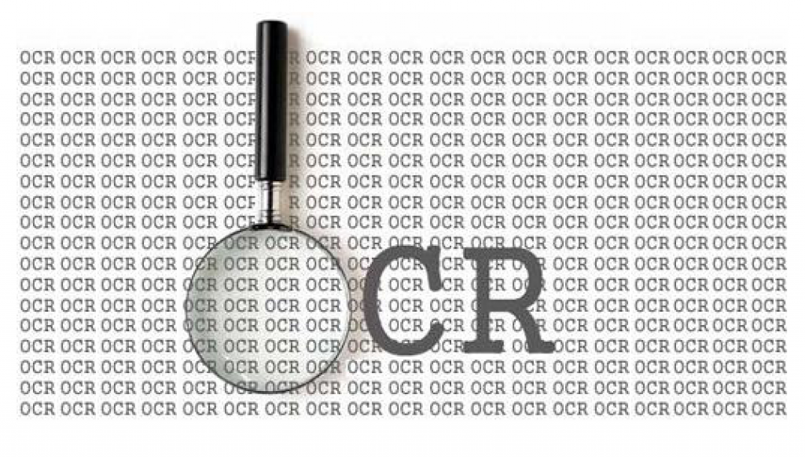

# Project: OCR (Optical Character Recognition) 




**Project summary**: 

+ This project creates an OCR post-processing procedure to enhance Tesseract OCR output.
  
+ Steps as follow:
  
 + 1. Preprocess the data, manually trimmed ground truth since there are 13 pairs of Tesseract and ground truth files that do not have the same number of lines. 
 
 + 2. Error Detection, use rule based method from [paper D1](doc/paper/D-1.pdf).

 + 3. Error Correction, first calculate 6 features scoring for each candidate based on [paper C2](doc/paper/C-2.pdf), then use AdaBoost.R2 model on top of decision trees with 0-1 loss function. Generate a prediction of top 3 best results as correction.

 + 4. Evaluate detection preformance by calculating precision and recall for word-level. Then construct a confusion matrix.

 + 5. Evaluated correction performance by calculating precision and recall for both word-level and character-level. Then calculate Top 3 candidate coverage.

 + 6. Evaluate the algorithm as a whole.
	
**Functions**: 

+ Four functions were implemented for different purposes of this project. 
+ Detailed descriptions can be found [here](lib/README.md).
	


**Github Organization**:

Following [suggestions](http://nicercode.github.io/blog/2013-04-05-projects/) by [RICH FITZJOHN](http://nicercode.github.io/about/#Team) (@richfitz). This folder is orgarnized as follows.

```
proj/
├── lib/
├── data/
├── doc/
├── figs/
└── output/
```

Please see each subfolder for a README file.
